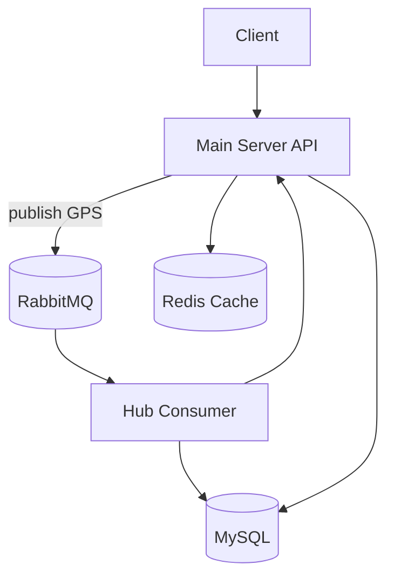

# Architecture / 아키텍처

## System Structure / 시스템 구조
- Main Server: Admin/Auth/Car/DriveLog APIs, Redis cache, MyBatis filtering. Entry: [back/main-server/src/main/java/com/example/mainserver/MainApplication.java](back/main-server/src/main/java/com/example/mainserver/MainApplication.java#L31)
- Hub Server: RabbitMQ consumer and position updater. Entry: [back/hub-server/src/main/java/hub/HubApplication.java](back/hub-server/src/main/java/hub/HubApplication.java#L16)
- Common Module: shared DTOs/entities/JWT. See [back/common/src/main/java/com/example/common/domain/auth/JwtTokenProvider.java](back/common/src/main/java/com/example/common/domain/auth/JwtTokenProvider.java#L19) and [back/common/src/main/java/com/example/common/domain/car/CarEntity.java](back/common/src/main/java/com/example/common/domain/car/CarEntity.java#L16)

## Component Relationships / 컴포넌트 관계

Mappings: Producer [back/main-server/src/main/java/com/example/mainserver/collector/infrastructure/rabbitmq/GpsLogProducer.java](back/main-server/src/main/java/com/example/mainserver/collector/infrastructure/rabbitmq/GpsLogProducer.java#L11), Consumer [back/hub-server/src/main/java/hub/application/ConsumerService.java](back/hub-server/src/main/java/hub/application/ConsumerService.java#L23)

## Tech Stack / 기술 스택
- Java 17, Spring Boot 3.5.3: [back/build.gradle](back/build.gradle#L1), [back/main-server/build.gradle](back/main-server/build.gradle#L1)
- JWT/Auth: [back/common/src/main/java/com/example/common/domain/auth/JwtTokenProvider.java](back/common/src/main/java/com/example/common/domain/auth/JwtTokenProvider.java#L19)
- RabbitMQ: [back/main-server/src/main/java/com/example/mainserver/collector/config/RabbitMqConfig.java](back/main-server/src/main/java/com/example/mainserver/collector/config/RabbitMqConfig.java#L14)
- Redis cache: [back/main-server/src/main/java/com/example/mainserver/cache/CacheConfig.java](back/main-server/src/main/java/com/example/mainserver/cache/CacheConfig.java#L25)
- MyBatis filtering: [back/main-server/src/main/resources/mapper/CarMapper.xml](back/main-server/src/main/resources/mapper/CarMapper.xml#L5), [back/main-server/src/main/resources/mapper/DriveLogMapper.xml](back/main-server/src/main/resources/mapper/DriveLogMapper.xml#L5)

## Runtime Configuration / 런타임 설정
- Main server config: [back/main-server/src/main/resources/application.yml](back/main-server/src/main/resources/application.yml#L1)
- Hub server config: [back/hub-server/src/main/resources/application.yml](back/hub-server/src/main/resources/application.yml#L1)
- Docker Compose: [back/docker/docker-compose.yml](back/docker/docker-compose.yml#L1)

## Note on FigJam / FigJam 관련
Figma MCP is not available in this environment, so diagrams are provided in Mermaid only.
이 환경에서는 Figma MCP를 사용할 수 없어 Mermaid 다이어그램만 제공됩니다.
