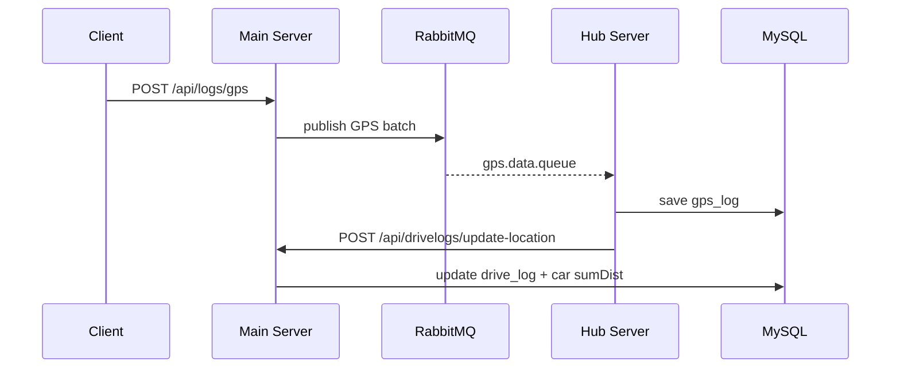

# Data Flow / 데이터 흐름

## GPS Ingestion Pipeline / GPS 수집 파이프라인
1. Collector API receives GPS logs. [back/main-server/src/main/java/com/example/mainserver/collector/controller/CollectorController.java](back/main-server/src/main/java/com/example/mainserver/collector/controller/CollectorController.java#L16)
2. CollectorService validates and publishes to RabbitMQ. [back/main-server/src/main/java/com/example/mainserver/collector/application/CollectorService.java](back/main-server/src/main/java/com/example/mainserver/collector/application/CollectorService.java#L23), [back/main-server/src/main/java/com/example/mainserver/collector/infrastructure/rabbitmq/GpsLogProducer.java](back/main-server/src/main/java/com/example/mainserver/collector/infrastructure/rabbitmq/GpsLogProducer.java#L11)
3. Hub Consumer reads queue, persists GPS logs, and schedules location updates. [back/hub-server/src/main/java/hub/application/ConsumerService.java](back/hub-server/src/main/java/hub/application/ConsumerService.java#L23), [back/hub-server/src/main/java/hub/application/LastPositionUpdator.java](back/hub-server/src/main/java/hub/application/LastPositionUpdator.java#L16)
4. Hub updates car position and notifies main server to update live drive logs. [back/hub-server/src/main/java/hub/infrastructure/CarPostionWriterImpl.java](back/hub-server/src/main/java/hub/infrastructure/CarPostionWriterImpl.java#L21)
5. Main server updates active drive log and sumDist. [back/main-server/src/main/java/com/example/mainserver/drivelog/application/DriveLogService.java](back/main-server/src/main/java/com/example/mainserver/drivelog/application/DriveLogService.java#L30)

## Sequence Diagram / 시퀀스 다이어그램

## Drive Log Lifecycle / 주행 로그 라이프사이클
- Start: [back/main-server/src/main/java/com/example/mainserver/drivelog/controller/DriveLogController.java](back/main-server/src/main/java/com/example/mainserver/drivelog/controller/DriveLogController.java#L34)
- End: [back/main-server/src/main/java/com/example/mainserver/drivelog/controller/DriveLogController.java](back/main-server/src/main/java/com/example/mainserver/drivelog/controller/DriveLogController.java#L40)
- Live update: [back/main-server/src/main/java/com/example/mainserver/drivelog/controller/DriveLogController.java](back/main-server/src/main/java/com/example/mainserver/drivelog/controller/DriveLogController.java#L98)

## Caching / 캐싱
Car and DriveLog filtering responses are cached via Redis. [back/main-server/src/main/java/com/example/mainserver/cache/CacheConfig.java](back/main-server/src/main/java/com/example/mainserver/cache/CacheConfig.java#L25), [back/main-server/src/main/java/com/example/mainserver/cache/CarFilterCache.java](back/main-server/src/main/java/com/example/mainserver/cache/CarFilterCache.java#L15), [back/main-server/src/main/java/com/example/mainserver/cache/DriveLogFilterCache.java](back/main-server/src/main/java/com/example/mainserver/cache/DriveLogFilterCache.java#L15)
