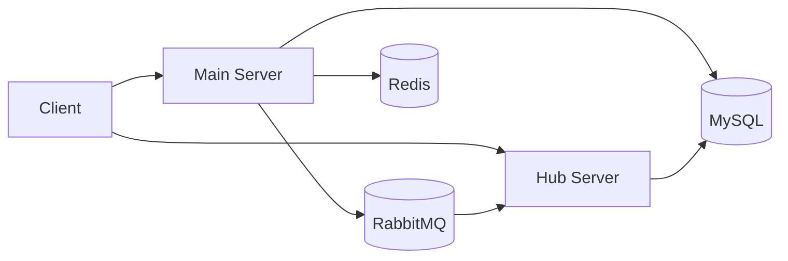
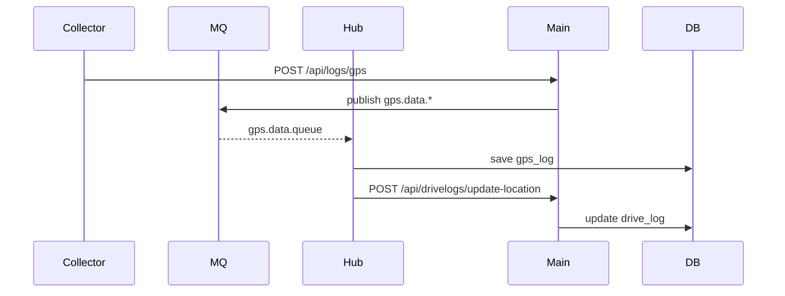
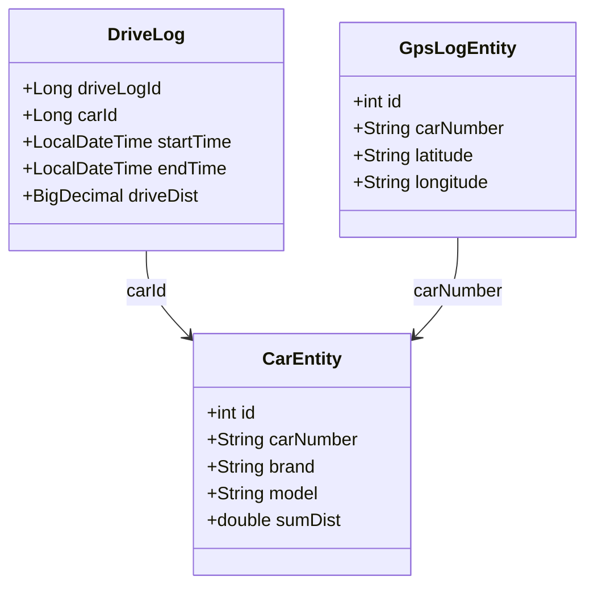

# Diagrams / 다이어그램

## Architecture / 아키텍처

Code references: [back/main-server/src/main/java/com/example/mainserver/collector/infrastructure/rabbitmq/GpsLogProducer.java](back/main-server/src/main/java/com/example/mainserver/collector/infrastructure/rabbitmq/GpsLogProducer.java#L11), [back/hub-server/src/main/java/hub/application/ConsumerService.java](back/hub-server/src/main/java/hub/application/ConsumerService.java#L23)

## Sequence / 시퀀스

## Class Diagram / 클래스 다이어그램

References: [back/common/src/main/java/com/example/common/domain/car/CarEntity.java](back/common/src/main/java/com/example/common/domain/car/CarEntity.java#L16), [back/main-server/src/main/java/com/example/mainserver/drivelog/domain/DriveLog.java](back/main-server/src/main/java/com/example/mainserver/drivelog/domain/DriveLog.java#L17), [back/hub-server/src/main/java/hub/domain/GpsLogEntity.java](back/hub-server/src/main/java/hub/domain/GpsLogEntity.java#L15)
