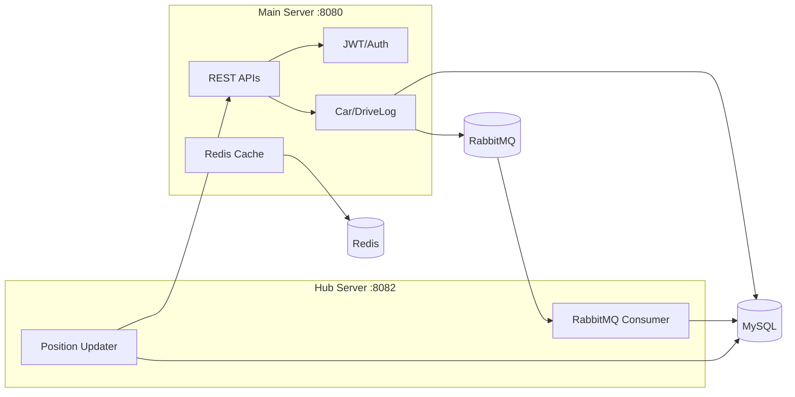

# 2theCore Backend Wiki

## Overview / 개요
2theCore는 차량 운영 기업을 위한 실시간 관제 백엔드입니다. 메인 서버는 관리/차량/주행 로그 API를 제공하고, 허브 서버는 RabbitMQ로 수집된 GPS 데이터를 소비해 차량 상태와 주행 정보를 갱신합니다.

2theCore is a real-time fleet operations backend. The main server provides admin/car/drivelog APIs, and the hub server consumes GPS messages from RabbitMQ to update vehicle positions and driving data.

Key entry points: [back/main-server/src/main/java/com/example/mainserver/MainApplication.java](back/main-server/src/main/java/com/example/mainserver/MainApplication.java#L31), [back/hub-server/src/main/java/hub/HubApplication.java](back/hub-server/src/main/java/hub/HubApplication.java#L16)

## Architecture (Mermaid) / 아키텍처 (Mermaid)


Reference: [back/main-server/src/main/java/com/example/mainserver/collector/infrastructure/rabbitmq/GpsLogProducer.java](back/main-server/src/main/java/com/example/mainserver/collector/infrastructure/rabbitmq/GpsLogProducer.java#L11), [back/hub-server/src/main/java/hub/application/ConsumerService.java](back/hub-server/src/main/java/hub/application/ConsumerService.java#L23)

## Quick Start / 빠른 시작
Prereqs: Java 17, Docker.

```bash
cd back
./gradlew :main-server:bootRun
./gradlew :hub-server:bootRun
```

Docker (RabbitMQ, Redis, servers):
```bash
cd back/docker
docker compose --env-file ../prod.env up -d --build
```

Config references: [back/main-server/src/main/resources/application.yml](back/main-server/src/main/resources/application.yml#L1), [back/hub-server/src/main/resources/application.yml](back/hub-server/src/main/resources/application.yml#L1), [back/docker/docker-compose.yml](back/docker/docker-compose.yml#L1)
